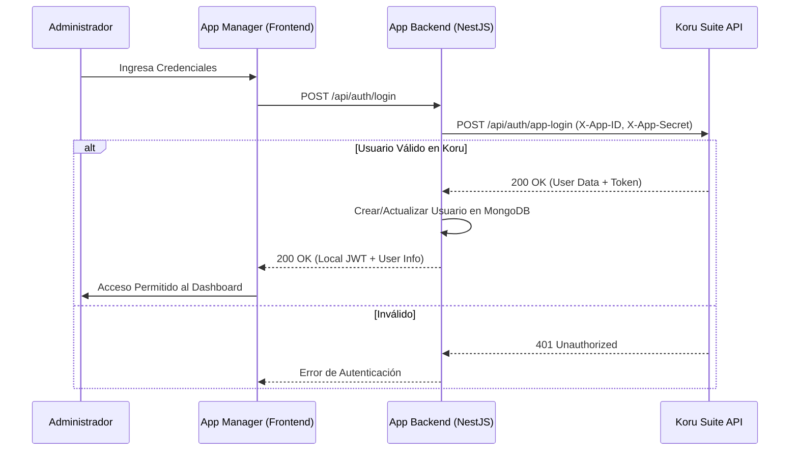
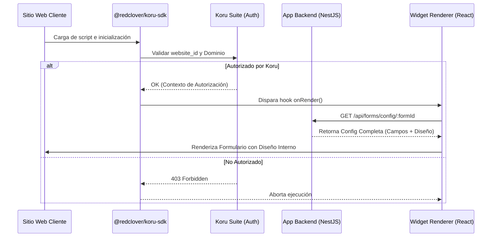

# Flujo de la Aplicación: Koru Contact Form & Koru Suite

Este documento describe el flujo integral de datos y seguridad entre el **App Manager (Backend/Frontend)**, el **Widget** y el ecosistema de **Koru Suite**.

## 1. Flujo de Autenticación (App Login)

Cuando el administrador accede al App Manager para gestionar sus formularios:

## 2. Configuración y Generación de Embed Code

El administrador configura su widget (campos y diseño) íntegramente desde el App Manager de Koru Contact Form.

1.  **Configuración Interna:** Todo el diseño (colores, iconos, mensajes) y la estructura del formulario se gestionan en nuestra base de datos.
2.  **Config Schema:** El archivo [`config_schema.json`](file:///c:/Users/Usuario/Desktop/Red%20Clover/Apps/koru-contact-form-app/form-widget/config_schema.json) está vacío, ya que Koru Suite solo actúa como puente de autenticación y carga.
3.  **Embed Code:** El backend genera el script con el JWT de seguridad.

## 3. Integración y Renderizado del Widget (Frontend del Cliente)

## 4. Envío de Datos (Submit)

Flujo final cuando el usuario completa el formulario:

1.  **Validación:** El Widget valida los campos obligatorios.
2.  **Envío:** Se realiza un `POST /api/forms/submit`.
3.  **Procesamiento (Backend):**
    -   Se guarda el log del mensaje en MongoDB.
    -   Se envía notificación por correo al Administrador.
    -   Si está activo, se envía auto-respuesta al Cliente.
4.  **Respuesta:** El Widget muestra el `success_msg` configurado en Koru Suite.

---

### Puntos Clave de Seguridad
- **Validación de Dominio:** El SDK garantiza que el widget solo funcione en sitios registrados.
- **JWT en Embed:** Protege el ID del formulario y del cliente.
- **Backend desacoplado:** La lógica de campos es interna, pero la estética es gobernada por Koru Suite.
